# Frontend Mentor - Calculator app


<br>

## Welcome! 👋

This is a solution to the [Calculator app challenge on Frontend Mentor](https://www.frontendmentor.io/challenges/calculator-app-9lteq5N29). Frontend Mentor challenges help you improve your coding skills by building realistic projects.

#### [*You can see the result by clicking here.*](https://clarabacker.github.io/calculator-app/)

<br>

## Table of contents

- [Overview](#overview)
  - [The challenge](#the-challenge)
  - [Screenshots](#screenshots)
    - [Desktop View](#desktop-view)
    - [Mobile View](#mobile-view)
  - [Links](#links)
- [My process](#my-process)
  - [Built with](#built-with)
  - [What I learned](#what-i-learned)
- [Author](#author)
- [License](#license)

<br>

## Overview 

### The challenge

Users should be able to:
- See the size of the elements adjust based on their device's screen size
- Adjust the color theme based on your preference.
- Have the theme preference automatically remembered for future visits.
- Perform basic mathematical operations such as addition, subtraction, multiplication, and division.
- Use decimal and negative numbers in calculations.
- View operands and results with American formatting, including thousands separators and decimal points.
- Delete the last entered character to correct errors.
- Reset the calculator to start a new operation.

**Bonus**:
- Use big numbers.
- Change the current operator by clicking on another button that contains an operator.
- Perform consecutive calculations without the need to click the "=" button after each operation.
- View the result of the current operation and the history of the previous operation.

<br>

### Screenshots

#### Desktop View

&nbsp;&nbsp;&nbsp;&nbsp;&nbsp; - Themes 1, 2 and 3
<p align="center">
    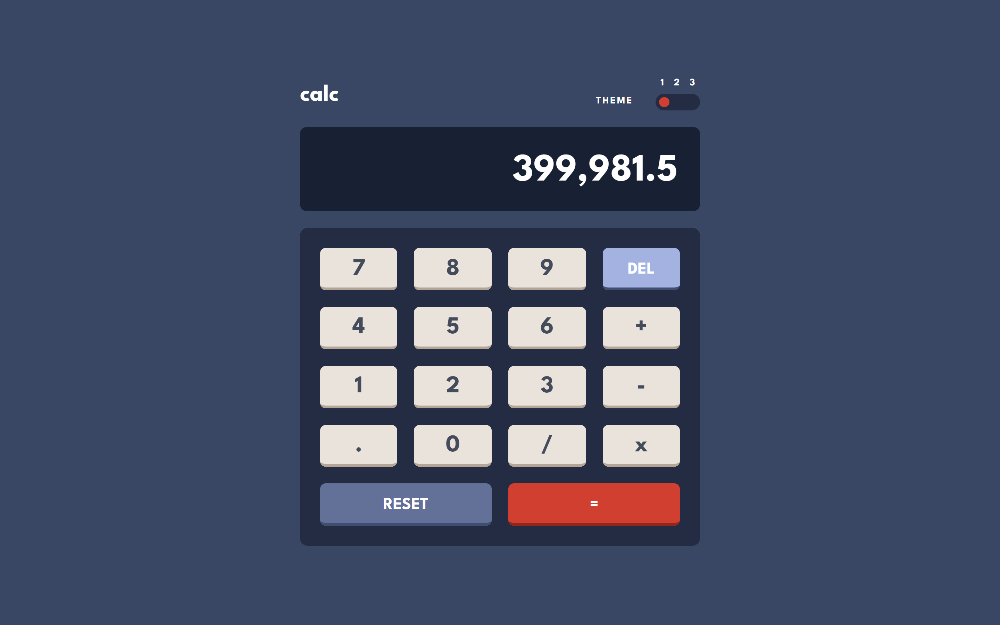
    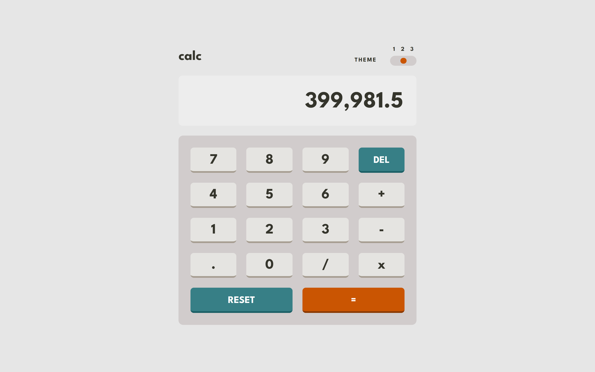
    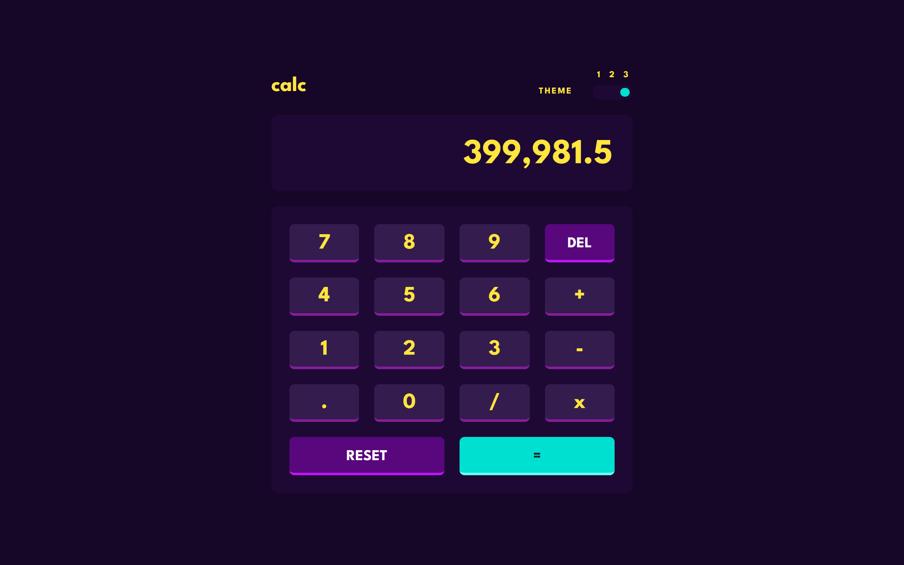
</p>

<br> 

&nbsp;&nbsp;&nbsp;&nbsp;&nbsp; - Consecutive calculations
<p align="center">
    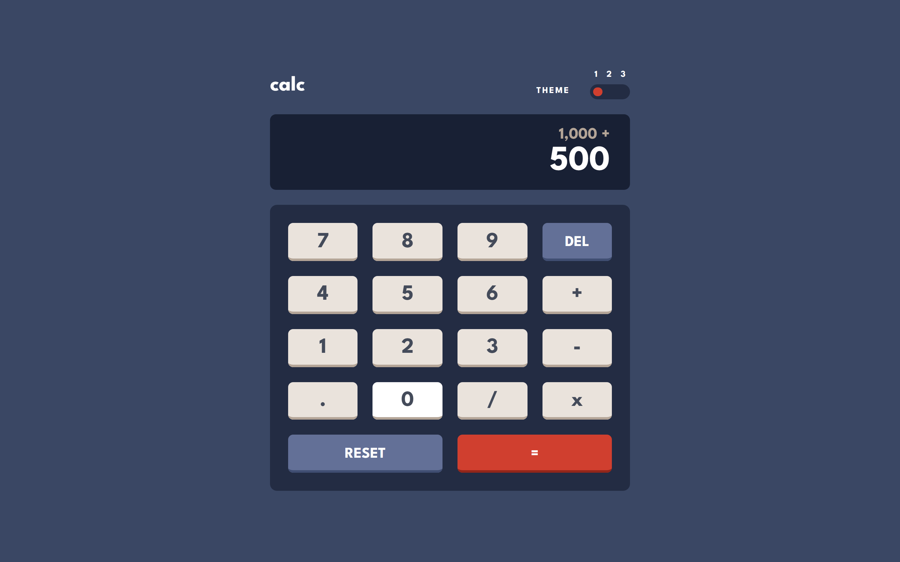
    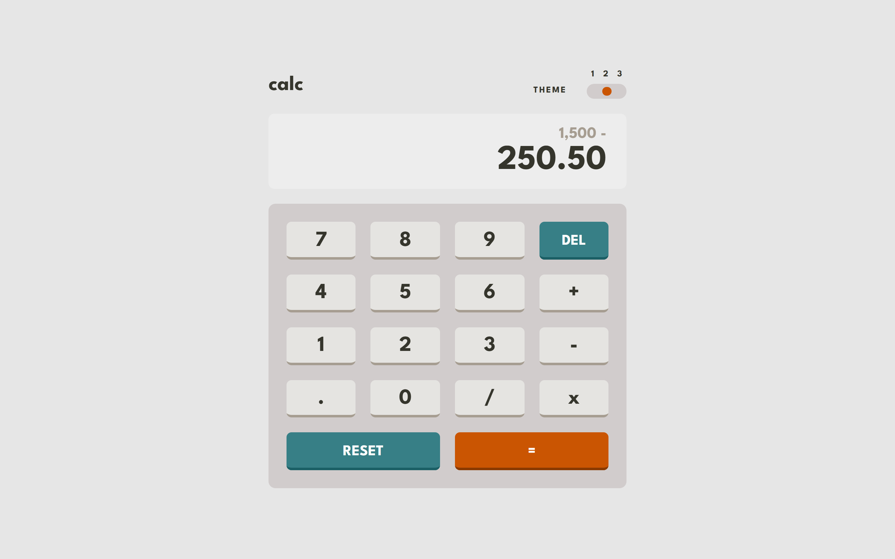
    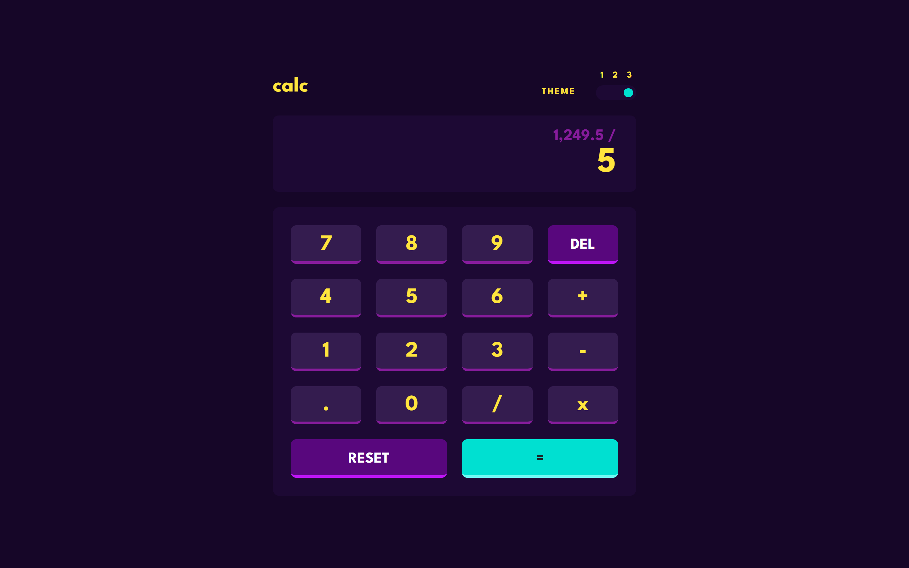
    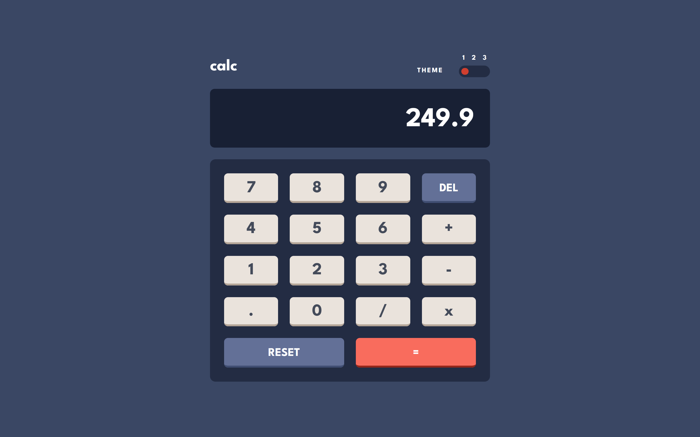
</p>

<br>

&nbsp;&nbsp;&nbsp;&nbsp;&nbsp; - Reset calculator
<p align="center">
    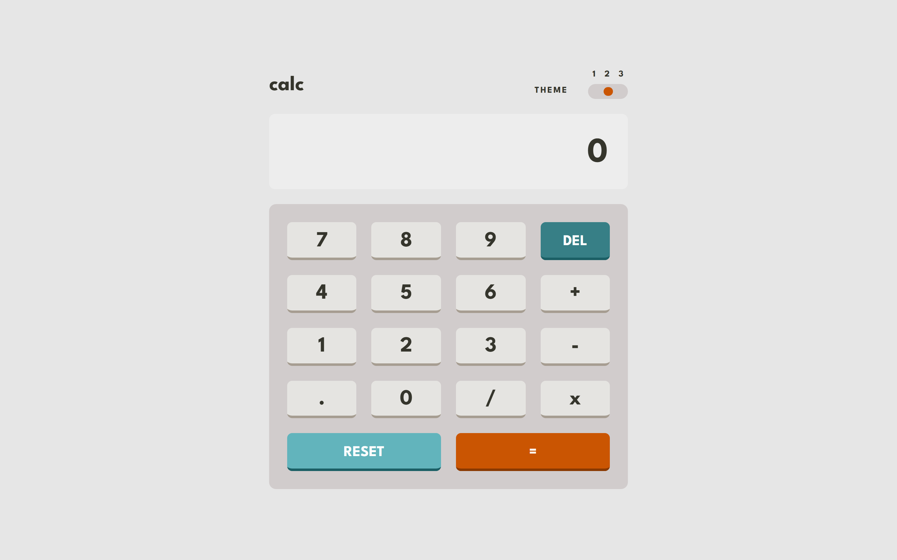
</p>

<br>

&nbsp;&nbsp;&nbsp;&nbsp;&nbsp; - Delete the last entered character
<p align="center">
    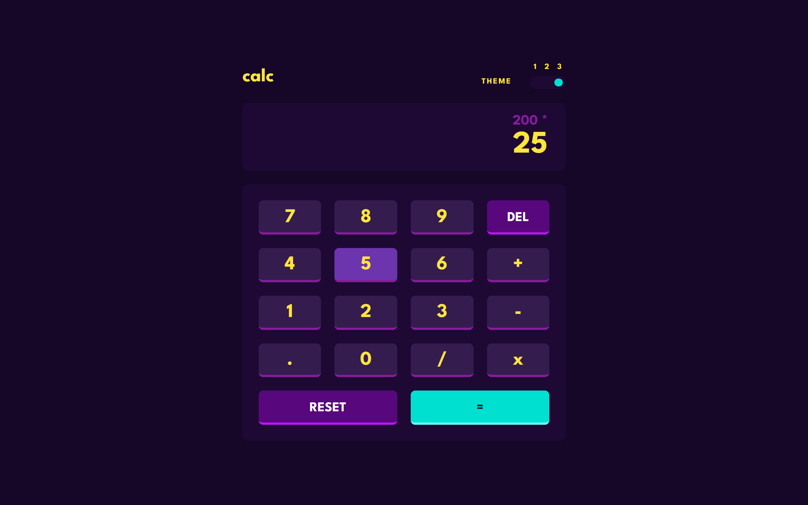
    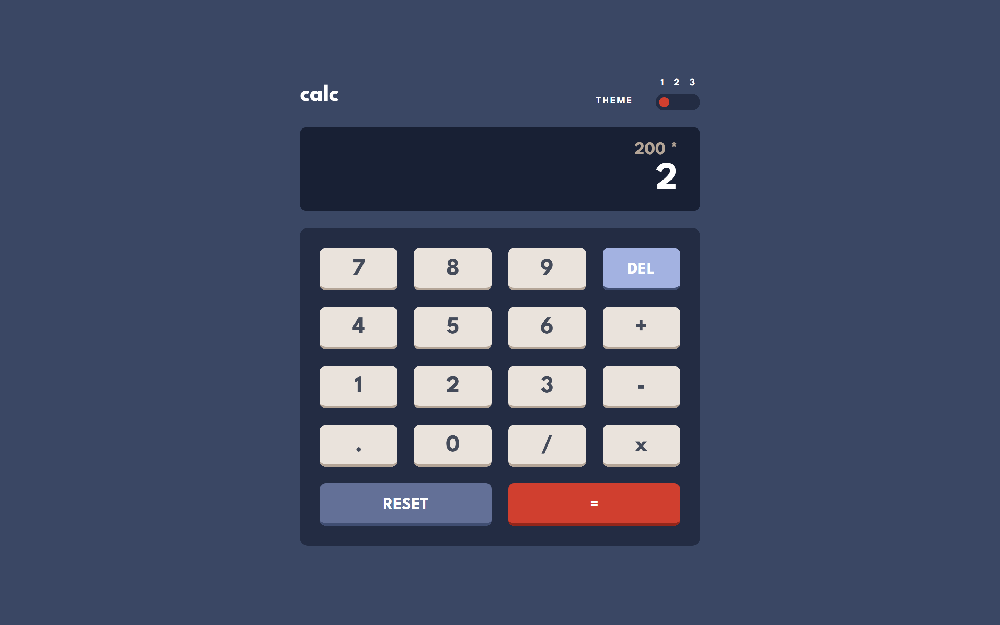
</p>

<br>

&nbsp;&nbsp;&nbsp;&nbsp;&nbsp; - Operation with big numbers
<p align="center">
    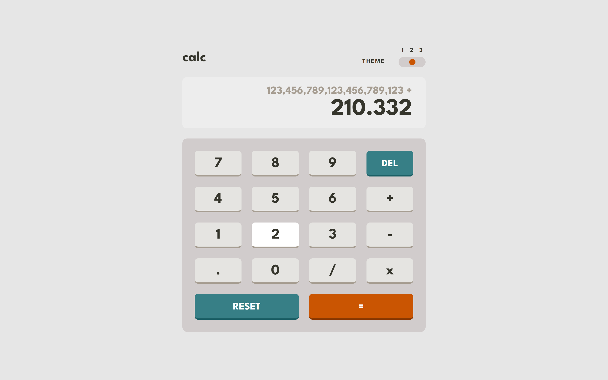
    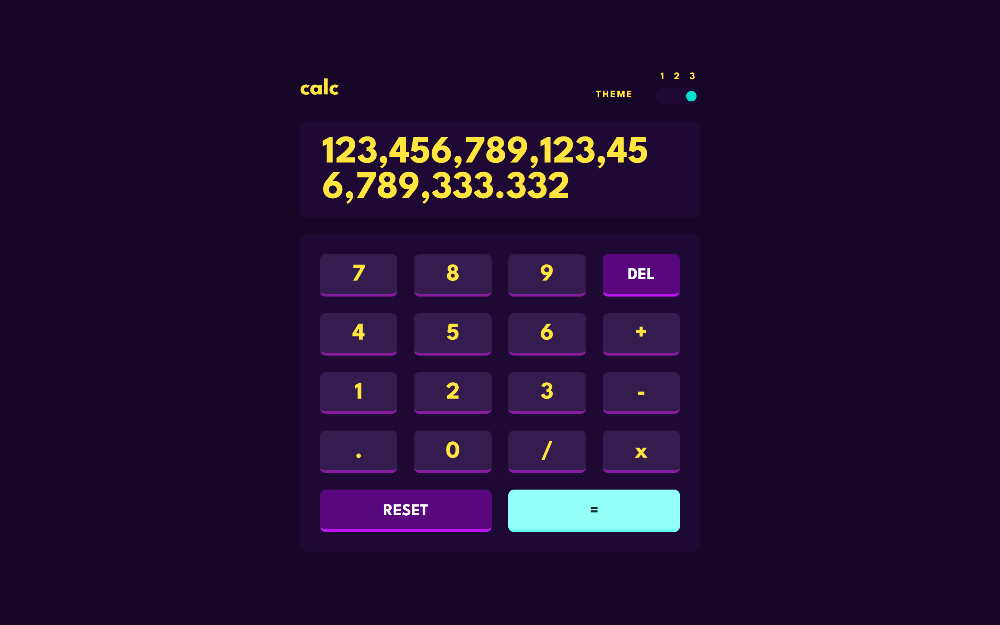
</p>

<br>

&nbsp;&nbsp;&nbsp;&nbsp;&nbsp; - Change the current operator
<p align="center">
    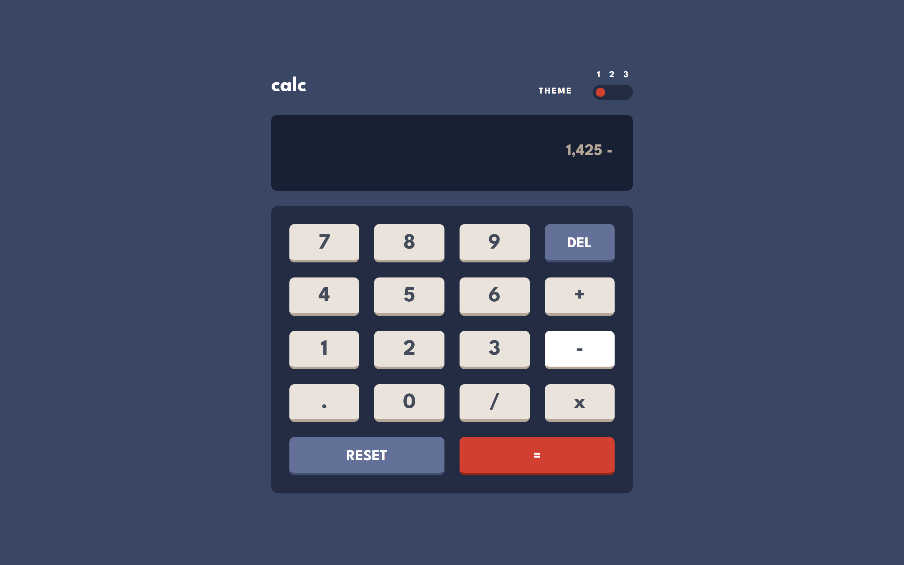
    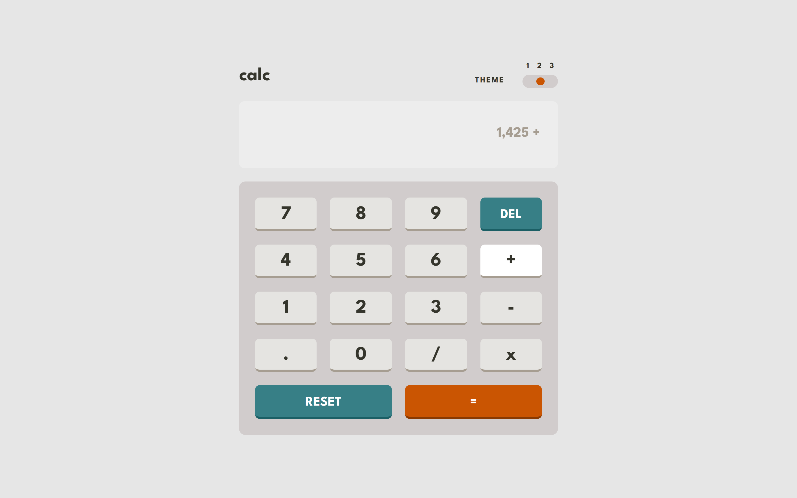
</p>

<br>

#### Mobile View

<p align="center">
    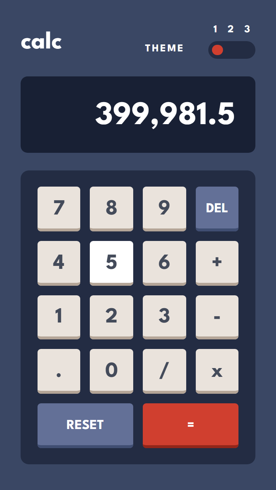  &nbsp;&nbsp;&nbsp;&nbsp;
    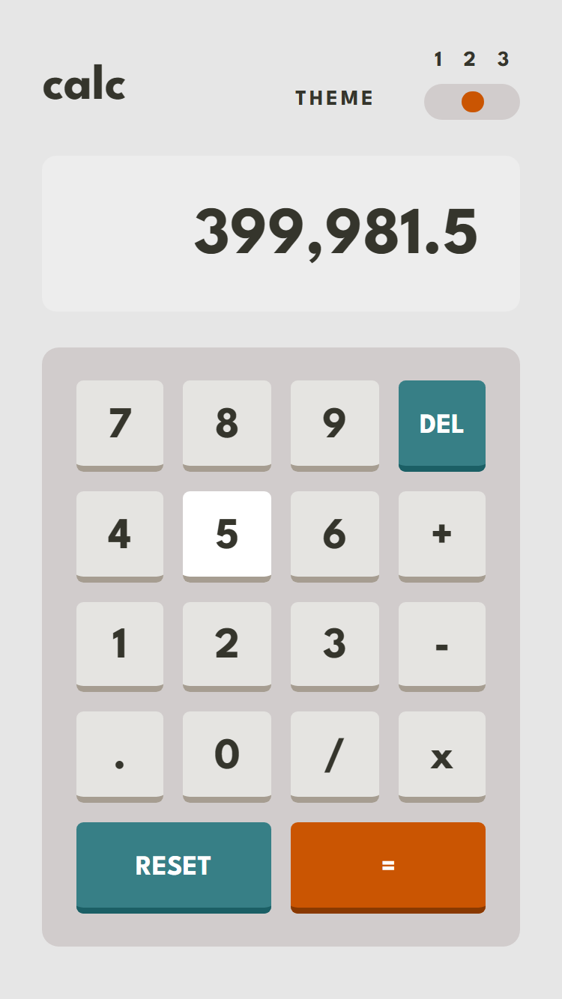  &nbsp;&nbsp;&nbsp;&nbsp;
    
</p>

<br>

### Links
- Solution URL: [https://www.frontendmentor.io/solutions/calculator-app-ADCGbrLPPq]
- Live Site URL: [https://clarabacker.github.io/calculator-app/]

<br>

## My process

### Built with:

- Semantic HTML5 markup
- CSS custom properties
- Flexbox
- CSS Grid
- Sass (using SCSS syntax)
- JavaScript
- Big.js library for precise decimal arithmetic
- Mobile-first workflow

<br> 

### What I learned:
- Using Sass for more efficient and organized CSS styling 

<br>

- How to create a toggle switch with three themes
```html
 <div class="toggle-slider">
    <input type="radio" name="toggle" id="position1" value="1" checked onChange="themeChange()">
    <label for="position1"></label>
    <input type="radio" name="toggle" id="position2" value="2" onChange="themeChange()">
    <label for="position2"></label>
    <input type="radio" name="toggle" id="position3" value="3" onChange="themeChange()">
    <button class="slider-button"></button>
    <label for="position3"></label>
</div>
 ```
 ```scss
.toggle-slider {
    @include size(4em, 1.5em);
    background-color: var(--toggle-bg);
    border-radius: 1.5em;
    position: relative;
    cursor: pointer;

    input {
        cursor: pointer;
    }

    button {
        background: var(--slider-button-bg);
        @include size(1.1em, 1.1em);
        border: none;
        border-radius: 50%;
        pointer-events: none;
        position: absolute;
        top: 0.35em;
        left: 0.3em;
        transition: all 0.3s ease-in-out;
    }

    #position1:checked ~ button {
        left: 0.4em;
    }
    #position2:checked ~ button {
        left: 1.9em;
    }
    #position3:checked ~ button {
        left: 3.3em;
    }

    input[type="radio"] {
        transform: scale(1.2);
    }
}

#position1, #position2, #position3 {
    position: absolute;
    top: 0.4em;
    opacity: 0;
}
#position1 {
    left: 0.6em;
}
#position2 {
    left: 2em;
}
#position3 {
    left: 3.3em;
}
```
<br>

- Utilizing the big.js library for precise arithmetic operations with big numbers

<br>

- Formatting numbers considering American formatting, which typically involves using a comma as a thousands separator and a period as a decimal separator
``` js
function formatNumberWithCommas(number) {
    // Convert the number to string and split it into integer and decimal parts
    let parts = number.toString().split(".")
    let integerPart = parts[0]
    let decimalPart

    // Check if the number has decimal part
    if (parts.length > 1) {
        decimalPart = "." + parts[1]
    } else {
        decimalPart = ""
    }

    // Insert commas as thousands separator in the integer part
    integerPart = integerPart.replace(/\B(?=(\d{3})+(?!\d))/g, ",")

    return integerPart + decimalPart
}
```
<br>

## Author

- Github - [Clara Backer](https://github.com/clarabacker)
- Frontend Mentor - [@clarabacker](https://www.frontendmentor.io/profile/clarabacker)
<br>

## License

This project is licensed under the [MIT License](./LICENSE). See the LICENSE file [LICENSE](./LICENSE) for more information.
